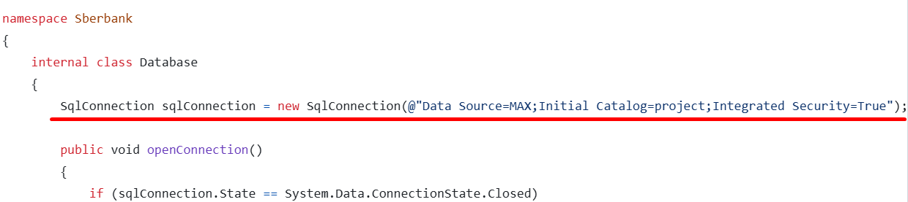

# Banking Application

## Overview
This is a C# banking application with an integrated admin panel for managing products. The application connects to an **MS SQL Server** database and provides CRUD operations (Create, Read, Update, Delete) for products and Adding and Deleting for administrators.

## Features
- **User Authentication**: Secure login system for administrators.
- **Admin Panel**: 
  - Add new products
  - Update product details
  - Delete products
  - View a list of products
- **Database Connectivity**: Uses **MSSQL** for data storage and retrieval.
- **Developed with Visual Studio Code**: Fully implemented in **VS Code** using **.NET Core**.
- **Windows Forms Interface**: The application uses **Windows Forms (WinForms)** for the UI, and forms must be manually created for full functionality.

## Prerequisites
- **.NET SDK** (latest version)
- **Visual Studio Code** with **C# extension**
- **MS SQL Server**
- **SQL Server Management Studio (optional, for database management)**

## Installation
1. Clone the repository:
   ```sh
   git clone https://github.com/maximusprimeavenger/Sberbank.git
   cd Sberbank
   ```
2. Configure the database connection string in DataBase.cs file in Sberbank directory:
  

3. Manually create the required Windows Forms for the application UI.
4. Run the application inside Visual Studio Code by clicking the "Run" button.

## Usage
- Open the application.
- Log in as an admin.
- Use the admin panel to manage products.

## Technologies Used
- **C# (.NET Core)**
- **MS SQL Server** (for data storage)
- **Windows Forms (WinForms)** (for the user interface)
- **Visual Studio Code** (as the development environment)

## License
This project is licensed under the MIT License.

## Contact
For any inquiries, reach out to **chuminmaksim@gmail.com**.

